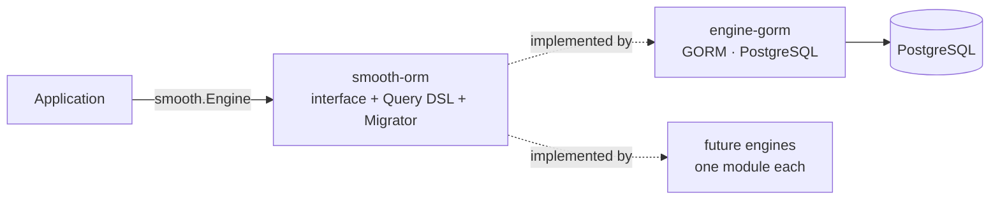

# SmoothORM

A lightweight, engine-agnostic ORM abstraction for Go.

SmoothORM defines a small database contract (the `Engine` interface), a declarative query DSL and an idempotent, SQL-based migration system — **without depending on any database driver or ORM**. Concrete implementations ("engines") live in separate Go modules, so your application depends only on the abstraction and the one engine it actually uses.

```
github.com/smoothorm/smooth-orm     ← this module (core abstraction, depends only on zap)
github.com/smoothorm/engine-gorm    ← GORM/PostgreSQL engine
```

## Why

- **Swappable persistence layer** — application code talks to `smooth.Engine`, never to GORM/pgx/etc. directly. Swapping engines is a one-line change at startup.
- **Clean dependency graph** — importing the core does not pull database drivers into your `go.mod`. Each engine is its own module (mirroring the `gorm.io/gorm` / `gorm.io/driver/*` pattern).
- **Migrations as plain SQL** — versioned, idempotent, executed atomically.

## Installation

```bash
go get github.com/smoothorm/smooth-orm
go get github.com/smoothorm/engine-gorm   # the engine you want
```

## Quick start

```go
package main

import (
	"context"
	"log"

	smoothengine "github.com/smoothorm/engine-gorm"
	smoothgorm "github.com/smoothorm/engine-gorm/gorm"
	"github.com/smoothorm/smooth-orm" // package name: smooth
)

type User struct {
	ID   uint   `json:"id" gorm:"primarykey;autoIncrement"`
	Name string `json:"name"`
}

func main() {
	sm, err := smooth.New(smoothengine.Gorm(smoothgorm.Config{
		Driver:   "postgres",
		Host:     "127.0.0.1",
		Port:     5432,
		User:     "postgres",
		Password: "secret",
		DataBase: "app",
	}), &smooth.Options{
		MigrationSystem: true,
	})
	if err != nil {
		log.Fatal(err)
	}

	// Idempotent migration: runs once, identified by "create-users-table".
	err = sm.Migration(smooth.Schema{
		SQL: `CREATE TABLE "public"."users" (
			"id"   bigserial PRIMARY KEY,
			"name" varchar(255) NOT NULL
		);`,
	}, "create-users-table")
	if err != nil {
		log.Fatal(err)
	}

	ctx := context.Background()

	// Create
	u := User{Name: "Ada"}
	if err := sm.DB.Create(ctx, &u); err != nil {
		log.Fatal(err)
	}

	// Fetch one (see "First semantics" below)
	var found *User
	if err := sm.DB.First(ctx, &found, smooth.Query{
		Where: &[]smooth.Where{{Column: "name", Value: "Ada"}},
	}); err != nil {
		log.Fatal(err)
	}
	if found == nil {
		log.Println("not found")
	}
}
```

## Core concepts

### `smooth.New(engine, options)`

Validates the connection via `engine.Health()` and returns a `*Smooth`:

| Field | Description |
|---|---|
| `Smooth.DB` | The `Engine` — all CRUD/query/transaction operations |
| `Smooth.Migrator` | Migration runner (only set when `Options.MigrationSystem` is `true`) |

When `MigrationSystem` is enabled, `New` also ensures the `public.migrations` control table exists (creating it on first run).

### The `Engine` interface

Every engine implements this contract ([engine.go](engine.go)):

```go
type Engine interface {
	First(ctx context.Context, dest interface{}, q Query) error  // fetch one record
	Get(ctx context.Context, dest interface{}, q Query) error    // fetch many records
	Create(ctx context.Context, model interface{}) error
	Update(ctx context.Context, model interface{}) error
	Delete(ctx context.Context, model interface{}) error
	Raw(ctx context.Context, dest interface{}, q Query) error    // raw SQL scanned into dest
	Exec(ctx context.Context, sql string) error                  // raw SQL, no result
	Health() (bool, error)
	Transaction(ctx context.Context, fn func(ctx context.Context) error) error
}
```

### Query DSL

`smooth.Query` ([query.go](query.go)) is a declarative description of a query. Each engine translates it to its own syntax. All fields are optional.

```go
smooth.Query{
	Where: &[]smooth.Where{
		{Column: "age", Condition: ">", Value: 18}, // Condition defaults to "=" when empty
		{Column: "active", Value: true},
	},
	Limit:  &limit,           // *int
	Offset: &offset,          // *int
	With:   &[]smooth.With{{Field: "Orders"}},          // eager-load relations (GORM Preload)
	InnerJoins: &[]smooth.InnerJoins{{Field: "Company"}}, // inner join a relation
	Raw: &smooth.Raw{         // raw query with placeholders (used by Raw())
		Query:      "SELECT count(*) FROM users WHERE age > ?",
		Interfaces: []interface{}{18},
	},
	Debug:    false, // log the generated SQL
	Unscoped: false, // include soft-deleted records
}
```

### Transactions

`Transaction` propagates the transaction through the `context.Context`. Every operation called with that context — including `Exec` — automatically joins the transaction; the callback returning an error rolls everything back:

```go
err := sm.DB.Transaction(ctx, func(txCtx context.Context) error {
	if err := sm.DB.Create(txCtx, &a); err != nil {
		return err // rollback
	}
	return sm.DB.Create(txCtx, &b) // commit if nil
})
```

> Always pass the callback's `txCtx` (not the outer `ctx`) to operations that must run inside the transaction.

### Migrations

Migrations are raw SQL blocks identified by a unique string:

```go
sm.Migration(smooth.Schema{SQL: "ALTER TABLE users ADD COLUMN email varchar(255);"}, "add-users-email")
```

Behavior:

- **Idempotent** — the identifier is recorded in the `public.migrations` table; a migration whose identifier is already registered is silently skipped. Never reuse an identifier for different SQL.
- **Atomic** — the SQL and the identifier record are written inside a single `Transaction`. If either fails, both roll back (requires an engine/database with transactional DDL, such as PostgreSQL).
- Calling `Migration` with `MigrationSystem: false` (or `nil` options) returns `ErrMigrationSystemDisabled`.

## Behavioral contract (important for engine implementers and AI agents)

These rules are part of the interface contract even though the compiler cannot enforce them. The `Migrator` and application code rely on them:

1. **`First` takes a pointer-to-pointer (`**T`) and does NOT error on "not found".**
   The destination must be a *nil* `*T` passed by address (`var u *User; First(ctx, &u, q)`). If no record matches, `First` returns `nil` and leaves the pointer `nil` — *not found* is signaled by the nil pointer, not by an error. A non-nil error always means a real failure.
2. **`Get` fetches collections and DOES return `smooth.ErrRecordNotFound`** when the underlying engine reports it. This asymmetry with `First` is intentional.
3. **Transactions travel in the context.** `Transaction` must inject its transaction handle into the context it passes to the callback, and `Create`, `Update`, `Delete`, `Raw` and `Exec` must detect and use it. Operations called with a non-transactional context run standalone.
4. **`Exec`/`Raw` receive engine-native SQL.** The core does not parse or rewrite SQL. The bundled migration system currently issues PostgreSQL-flavored SQL (`information_schema`, `public` schema), so engines enabling `MigrationSystem` must target a PostgreSQL-compatible database.
5. **`Health` gates construction.** `smooth.New` refuses to build if `Health()` returns `false`; return a descriptive error.

An engine is any type satisfying `smooth.Engine` under these rules — see [github.com/smoothorm/engine-gorm](https://github.com/smoothorm/engine-gorm) for the reference implementation.

## Errors

| Error | Meaning |
|---|---|
| `smooth.ErrRecordNotFound` | `Get` found no records |
| `smooth.ErrMigrationSystemDisabled` | `Migration` called without `Options.MigrationSystem` |

## Architecture



The core module depends only on [zap](https://github.com/uber-go/zap) (structured logging). Each engine is a separate Go module with its own dependencies, released and versioned independently.

## Developing core + engine together

Use a [Go workspace](https://go.dev/ref/mod#workspaces) in a parent folder so the engine builds against your local core:

```
smoothorm/
├── go.work
├── smooth-orm/     (this repo)
└── engine-gorm/
```

```
go 1.25.1

use (
	./smooth-orm
	./engine-gorm
)
```

If `engine-gorm/go.mod` requires a core version that is not published yet, add a version-specific replace to `go.work`:

```
replace github.com/smoothorm/smooth-orm v1.0.0 => ./smooth-orm
```

## License

[MIT](LICENSE)
